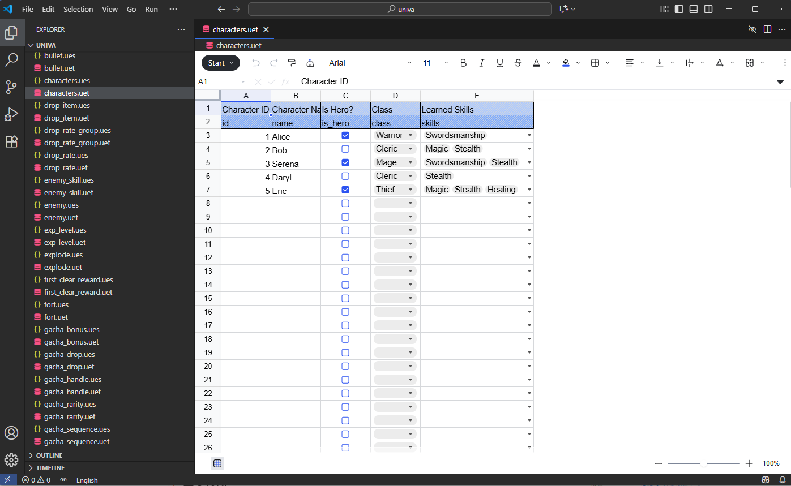

# Univa Editor – Schema-based Master Data Management

> Edit master data in VS Code with Excel/Spreadsheet-like interface.

---

## Preview


## Overview
Univa Editor is a VS Code extension that allows you to manage master data using separate schema and data files.  
By combining `.ues` schema files with `.uec/.uet` data files, you can edit data in a spreadsheet-like interface directly inside VS Code.

### Schema File (`.ues`)
- Define column types (string, integer, decimal, boolean, list)
- Add comments or set column widths

### Data File (`.uec/.uet`)
- CSV or TSV format for easy data management
- Supports input assistance based on schema

### Supported Data Types
- `none` (default)
- `integer` / `decimal`
- `boolean` (checkbox)  
- `list` (dropdown)  
- `multiple list` (multi-select dropdown)

### User Experience
- Edit directly in VS Code  
- Spreadsheet-like row/column editing  
- Automatic input validation based on schema

### Use Cases
- Game or application master data management  
- Configuration file editing  
- Small team data sharing

### Features
- Separate the schema file (`.ues`) and the data file (`.uec/.uet`), which have identical file names and work as a pair.  
  - Example: `characters.ues` ↔ `characters.uec`  
- Spreadsheet-like data entry  
- Input assistance for each data type (checkbox, dropdown, multi-select)  
- Seamless editing within VS Code
- Column display order depends on the definition in the `.ues` file
- The header row is protected and cannot be edited

---

## Sample Schema: `characters.ues`

```json
{
  "columns": {
    "id": {
      "comment": "Character ID",
      "type": "integer"
    },
    "name": {
      "comment": "Character Name"
    },
    "is_hero": {
      "comment": "Is Hero?",
      "type": "boolean"
    },
    "class": {
      "comment": "Class",
      "type": "class_type"
    },
    "skills": {
      "comment": "Learned Skills",
      "type": "skills_type",
      "width": 200
    }
  },
  "list": {
    "class_type": {
      "entries": {
        "0": "Warrior",
        "1": "Mage",
        "2": "Thief",
        "3": "Cleric"
      }
    },
    "skills_type": {
      "multiple": true,
      "entries": {
        "0": "None",
        "1": "Swordsmanship",
        "2": "Magic",
        "3": "Stealth",
        "4": "Healing"
      }
    }
  }
}

```

## Sample Data: `characters.uec`
```csv
id,name,is_hero,class,skills
1,Alice,1,0,1
2,Bob,0,3,"2,3"
3,Serena,1,1,"1,3"
4,Daryl,0,3,3
5,Eric,1,2,"2,3,4"
```

## Technology Stack

This extension is powered by 
- [Univer](https://github.com/dream-num/univer)
